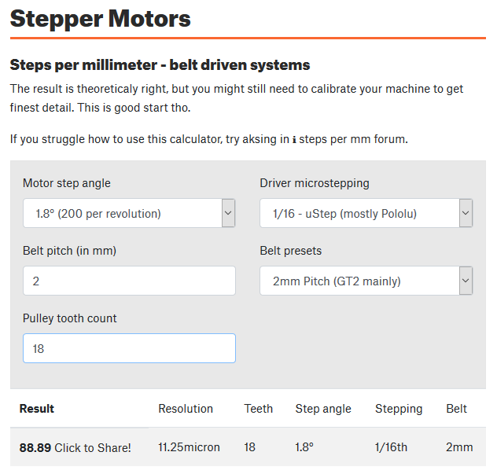
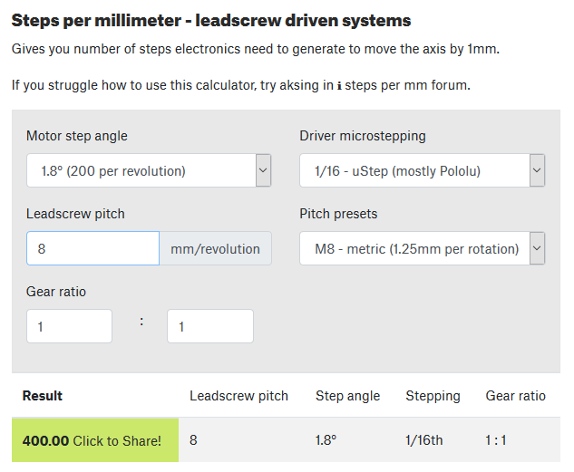

# TAKEONE 3D PRINTER
> powerd by BIQU Bigtreetech KFB 2

## Story Behind This Project
This project was to convert MakerBot Replicator 2 which had failed with me several times and had lots of issues when trying to print because it didn't have a heated bed at the beginning so I bought a heated bed but the board doesn't support it. so I decided swap the board and convert it to marlin firmware 2.0 with auto leveling and heated bed, here you will find every thing, from wiring and steps I took and the boards I used.

## The Board I Used ?
I had another 3d printer which is Anet A8, it was given to me by a friend because he didn't know how to operate it since it was a DIY, but never had time for it, so I dismantled the board and thought why not change the firmware to operate my old MakerBot Replicator 2 -> I renamed the 3D Printer To TAKEONE3D Printer.

## Mechanical Structure Properties
the MakerBot replicator 2 steppers are 200 steps per revolution,

for X and Y axis they use T2 timing belts



and for Z threaded screw



### Steps Per Millimeter For X/Y/Z Axis
```
88.89     step/mm For X
88.89     step/mm For Y
400       step/mm For Z
101       step/mm For E
```

### Max Feedrate For X/Y/Z Axis
```
19000     mm/sec For X
18000     mm/sec For Y
5000      mm/sec For Z
unknown   mm/sec For E
```
